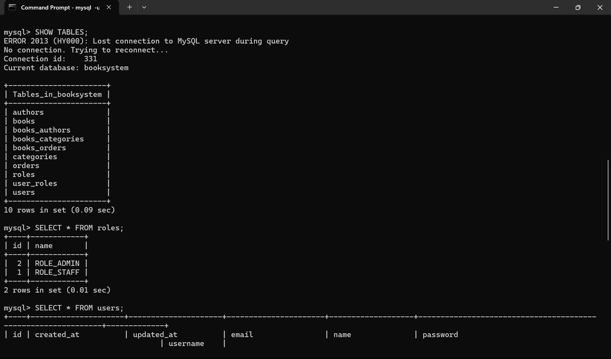
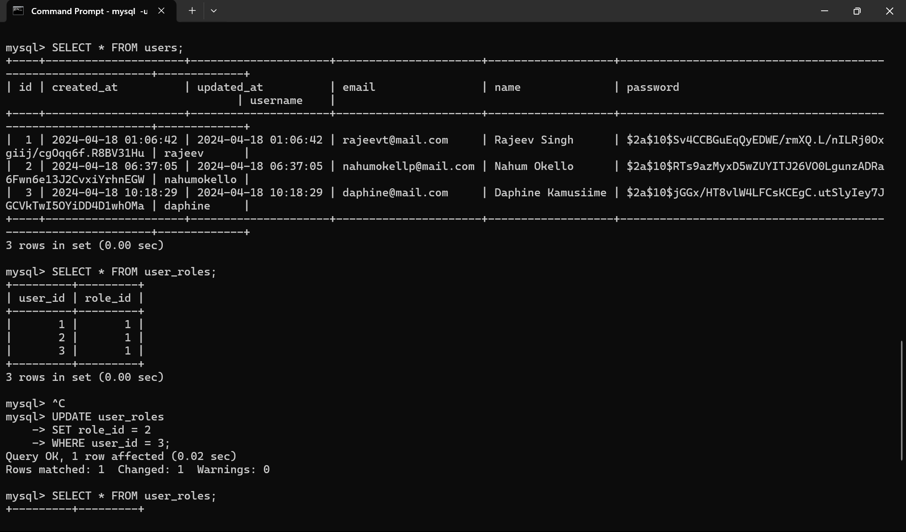

# An advanced bookstore inventory system focusing on the API side using Spring Boot.

- Book has fields such as: ID, ISBN, Name, Author, Categories
  Frontend should be able to show, all the details of each book.
- An admin should be able to add books to the store.
- The admin should have the ability to know when the book was inserted and updated in the system.
- The API should be able to handle Unexpected scenarios and return to the clients.

# Requirements

- Java 21
- Maven 3.x
- Spring Web
- Spring Data JPA
- Spring Security

# Setting up

1. Have [Java](https://www.oracle.com/java/technologies/downloads/) and [Maven](https://maven.apache.org/) installed
2. Open the command line in the source code folder
3. Installing dependencies

```bash
 mvn install
```

4.  Run project

```bash
  mvn spring-boot:run
```

# Creating Default Roles

Establishing a predetermined set of roles within the application. Upon user login, the default role assigned will be ROLE_STAFF.

To facilitate role assignment, the roles must be pre-existing in the database. To achieve this, there is execution of the following insert statements to create the two default roles.

Query to be run to provide the result in the image below.

```bash
INSERT INTO roles(name) VALUES('ROLE_STAFF');
INSERT INTO roles(name) VALUES('ROLE_ADMIN');
```





#
